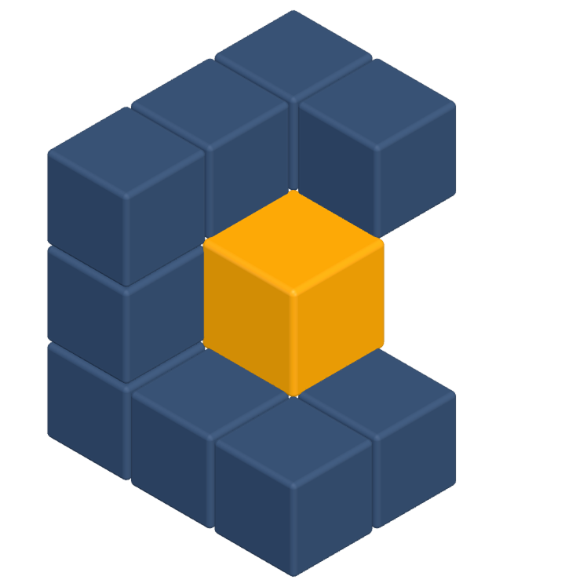

<p align="center">
  
</p>

# Cellar

Cellar is a container orchestrator control plane for isolated sandboxes.
This repository implements the **cluster identity layer** (mTLS gRPC, Raft-replicated CA) and
**sandbox lifecycle** (desired state in Raft, Docker + hardened runc on every node, userspace egress policy).

Clients: Go [`sdk/go`](sdk/go) and TypeScript [`@cellar/node`](sdk/node) talk to **`cellar-gateway`** over HTTPS — see [Client API](#client-api-remote-apps) and [`sdk/node/README.md`](sdk/node/README.md).

## Binaries

| Binary           | Role                                                                                                                                                             |
| ---------------- | ---------------------------------------------------------------------------------------------------------------------------------------------------------------- |
| `cellard`        | Always-on node daemon (manager or worker). Local control over a unix socket; remote gRPC on `:17946` after `init`/`join`. Runs sandboxes via host Docker.        |
| `cellar`         | CLI client (`init`, `join`, `join-token`, `status`, `api-key …`, `node …`, `sandbox …`) talking to local `cellard`.                                              |
| `cellar-gateway` | HTTP/JSON front door (Gin). Runs beside `cellard` on manager or worker hosts; proxies to manager `SandboxAPI` with the caller’s API key. Default listen `:8080`. |
| `cellar-agent`   | In-sandbox PID 1. Bound into each container; serves authenticated gRPC (`Health`, `RunCommand`) on a per-sandbox Unix socket.                                    |

## Roles

| Role        | Join token    | Raft  | Holds RootCA key                | Control plane |
| ----------- | ------------- | ----- | ------------------------------- | ------------- |
| **Manager** | manager token | Voter | Yes (via Raft `Cluster.RootCA`) | Yes           |
| **Worker**  | worker token  | No    | No                              | No            |

The CA private key and join secrets live on the raft-backed `Cluster.RootCA` object.
Local disk stores only this node’s leaf cert/key and the public CA cert.

## Ports / sockets

| Listener     | Default                       | Auth                                                                           | Purpose                                                                         |
| ------------ | ----------------------------- | ------------------------------------------------------------------------------ | ------------------------------------------------------------------------------- |
| Unix socket  | `/var/run/cellar/cellar.sock` | Local FS permissions                                                           | `Init`, `Join`, `JoinToken`, `Status`, `api-key …`, `node …`, local sandbox ops |
| Remote gRPC  | `:17946`                      | Bootstrap insecure TLS + token digest; else mTLS **or** API key (`SandboxAPI`) | CA issue/renew, raft membership, public sandbox client API                      |
| Gateway HTTP | `:8080`                       | API key (`Authorization: Bearer` / `X-Api-Key`); terminate TLS at ALB/proxy    | Public JSON API for apps (`cellar-gateway`)                                     |
| Raft TCP     | `127.0.0.1:17947`             | Manager network                                                                | Consensus / CA key replication                                                  |

## Build & install

```bash
make build                  # → bin/cellard, bin/cellar, bin/cellar-agent, bin/cellar-gateway, bin/cellar-egress-gateway
# or: make cellard / make cellar / make cellar-agent / make cellar-gateway / make cellar-egress-gateway
make egress-gateway-image   # → cellar/egress-gateway:latest (required for networked sandboxes)

sudo make install           # Linux: binaries → /usr/local/bin, plus systemd units + sysusers from contrib/
make install                # macOS: binaries → ~/.local/bin (no sudo), LaunchAgents, stage agent under ~/.cellar
```

Requires Go 1.26+. `cellar-agent` and `cellar-egress-gateway` are built with `CGO_ENABLED=0` and `GOOS=linux` (they run inside Linux containers, including on Docker Desktop for macOS). `make install` places them next to `cellard` (override with `CELLAR_AGENT_BINARY` if needed). It also installs:

| Source                                   | Destination (Linux)                              |
| ---------------------------------------- | ------------------------------------------------ |
| `contrib/systemd/cellard.service`        | `/usr/lib/systemd/system/cellard.service`        |
| `contrib/systemd/cellar-gateway.service` | `/usr/lib/systemd/system/cellar-gateway.service` |
| `contrib/systemd/cellar.sysusers`        | `/usr/lib/sysusers.d/cellar.conf`                |

| Source                                                 | Destination (macOS)                                           |
| ------------------------------------------------------ | ------------------------------------------------------------- |
| host binaries                                          | `~/.local/bin/`                                               |
| `contrib/launchd/com.prodioslabs.cellard.plist`        | `~/Library/LaunchAgents/com.prodioslabs.cellard.plist`        |
| `contrib/launchd/com.prodioslabs.cellar-gateway.plist` | `~/Library/LaunchAgents/com.prodioslabs.cellar-gateway.plist` |
| `cellar-agent` (staged for Docker Desktop)             | `~/.cellar/cellar-agent`                                      |

`make install` does not enable or start the services. On macOS, load agents with `launchctl bootstrap gui/$(id -u) …`. Use `make uninstall` to remove the installed files.

All four binaries share one SemVer. Local builds stamp version/commit/date via ldflags (`VERSION`, `COMMIT`, `BUILD_DATE` overrides). Check with:

```bash
cellar --version
cellard -version
cellar-gateway -version
cellar-agent -version
```

## Releases

Push a SemVer tag (`vX.Y.Z` or `vX.Y.Z-rc.1`) to publish a [GitHub Release](https://github.com/prodioslabs/cellar/releases) with Linux and macOS **amd64** / **arm64** archives, plus prebuilt `cellar/egress-gateway` image tarballs. `cellar-agent` and `cellar-egress-gateway` are Linux-only (they run inside containers); Darwin archives ship the host tools (`cellar`, `cellard`, `cellar-gateway`). The installer fetches the matching Linux archive on macOS so it can place `cellar-agent` beside `cellard`, and loads the egress-gateway image with `docker load`.

Each Linux archive is named `cellar_<version>_linux_<arch>.tar.gz` and contains:

```text
cellar
cellard
cellar-agent
cellar-gateway
cellar-egress-gateway
LICENSE
README.md
contrib/systemd/…
```

Darwin archives omit the Linux-only binaries and contain the three host tools plus `LICENSE`, `README.md`, `contrib/systemd/`, and `contrib/launchd/`.

Image archives (`cellar-egress-gateway-image_<version>_linux_<arch>.tar.gz`) are gzipped `docker save` outputs of `cellar/egress-gateway:latest` and `cellar/egress-gateway:vX.Y.Z`.

Install the current release on Linux or macOS with:

```bash
curl -fsSL https://cellar.prodioslabs.in/install.sh | sh
```

The installer detects the OS (**linux** / **darwin**) and arch (**amd64** / **arm64**), verifies archives against `checksums.txt`, and installs binaries. On Linux it also installs systemd units and the sysusers definition (same as `sudo make install`). On macOS it defaults to `~/.local` (no sudo), stages LaunchAgents under `~/Library/LaunchAgents`, and stages `cellar-agent` under `~/.cellar`. When Docker is available it downloads and loads the prebuilt `cellar/egress-gateway` image (skip with `CELLAR_SKIP_EGRESS_IMAGE=1`). It uses `sudo` when needed, but does not enable or start the services.

To install a specific version or prefix:

```bash
curl -fsSL https://cellar.prodioslabs.in/install.sh | CELLAR_VERSION=v0.1.0 CELLAR_PREFIX=/usr/local sh
```

## Quick start

```bash
# On each host — install, create the cellar system user, start the daemon
sudo make install
sudo systemd-sysusers
sudo systemctl daemon-reload
sudo systemctl enable --now cellard
sudo systemctl enable --now cellar-gateway   # optional: HTTP front door for apps

# Host A — initialize cluster (first manager)
# Use this host’s reachable address (defaults: data /var/lib/cellar, socket /var/run/cellar/cellar.sock)
sudo cellar init --advertise-addr 192.0.2.10:17946

# Print ready-to-run join command
sudo cellar join-token worker
# → cellar join --token CLLRN-1-… 192.0.2.10:17946

# Host B — worker (after install + enable --now cellard as above)
sudo cellar join --token CLLRN-1-… 192.0.2.10:17946
```

Managers join the same way with the **manager** token (and should pass `--advertise-addr` / `--raft-addr`).

## Manage Cellar as a non-root user

The control socket is mode `0660` and owned by `cellar:cellar`. By default only root can talk to it; to run `cellar` without `sudo`, add your user to the `cellar` group (created by `systemd-sysusers` from `contrib/systemd/cellar.sysusers`).

> **Warning:** The `cellar` group grants local control-plane access equivalent to root for CLI operations against the socket.

1. Add your user to the `cellar` group.

   ```bash
   sudo usermod -aG cellar $USER
   ```

2. Log out and log back in so that your group membership is re-evaluated. You can also activate the group in the current shell:

   ```bash
   newgrp cellar
   ```

3. Verify that you can run `cellar` without `sudo` (with `cellard` already running):

   ```bash
   cellar status
   ```

## Sandboxes

Requires Docker Engine (Linux) or Docker Desktop (macOS). Sandboxes run under Docker's default OCI runtime (`runc`) with `CapDrop: ALL`, `no-new-privileges`, a pids limit, and default seccomp/AppArmor. Egress is enforced by topology (internal Docker networks + shared egress gateway), not by host iptables.

Each sandbox runs with `cellar-agent` **as the container entrypoint** (PID 1 init + job supervisor). There is no create-time `--entrypoint` / `command`; the sandbox stays up until `stop`/`rm`. Workloads run via `sandbox exec` (Docker exec). Use `--detach` for background jobs.

```bash
# Create an isolated sandbox (no external network)
sudo cellar sandbox create --image alpine
# or a language runtime preset (resolves to an Alpine image):
sudo cellar sandbox create --runtime node-26
# or from YAML:
sudo cellar sandbox create -f examples/sandbox.yaml

# Allowlisted egress (enforced by topology + egress gateway).
# See internal/egress/README.md for proxy, DNS bait mount, and policy details.
# At most one of --domain-allow-list / --network-allow-list /
# --network-block-all / --network-allow-all:
sudo cellar sandbox create --image curlimages/curl \
  --domain-allow-list 'example.com'
# or: sudo cellar sandbox create -f examples/sandbox-allowlist.yaml
# --essential-services alone implies --network-block-all (curated hosts only):
sudo cellar sandbox create --image curlimages/curl --essential-services
sudo cellar sandbox create --image curlimages/curl \
  --domain-allow-list 'example.com,*.openai.com' --essential-services
sudo cellar sandbox create --image alpine --network-block-all
sudo cellar sandbox create --image curlimages/curl --network-allow-all
sudo cellar sandbox create --image alpine \
  --network-allow-list '208.80.154.232/32,192.168.1.0/24'

# Tighten (or loosen) the policy of a running sandbox. Takes effect immediately
# and closes connections the new policy no longer allows.
# Mode none cannot change live; blockall/allowall/allowlist/denylist can.
sudo cellar sandbox network <id> --domain-allow-list 'api.example.com'
sudo cellar sandbox network <id> --network-block-all
sudo cellar sandbox network <id> --network-allow-all

# Local node only (default). Use --all for the cluster, or --node <id|prefix>.
sudo cellar sandbox ls
sudo cellar sandbox ls --all
sudo cellar sandbox ls --node <id> --filter phase=running --format json
sudo cellar sandbox inspect <id>
sudo cellar sandbox logs -f <id>
sudo cellar sandbox exec <id> -- uname -a
# Background job (returns a job id):
sudo cellar sandbox exec --detach <id> -- sleep 3600
sudo cellar sandbox job ls <id>
sudo cellar sandbox job stop <id> <job-id>
sudo cellar sandbox job logs <id> <job-id>
sudo cellar sandbox stop <id>
sudo cellar sandbox rm <id>
```

**Security model.** Isolation is runc + dropped capabilities + no-new-privileges + pids limit + Docker seccomp/AppArmor + topology-based egress. Unlike gVisor, sandboxes share the host (or Docker Desktop VM) kernel — a kernel exploit in untrusted code can escape the container. For production Linux hosts, enable dockerd `userns-remap` so guest root maps to an unprivileged host UID. On macOS, blast radius is limited to the Docker Desktop Linux VM.

Runtime presets and their images:

| Runtime       | Image                         |
| ------------- | ----------------------------- |
| `node-26`     | `node:26-alpine`              |
| `bun-1.3`     | `oven/bun:1.3-alpine`         |
| `python-3.13` | `astral/uv:python3.13-alpine` |
| `go-1.26`     | `golang:1.26-alpine`          |

Managers and workers both run sandboxes. Desired state lives in Raft; the leader schedules onto the least-loaded live node
(nodes with availability `pause` or `drain` are skipped).

## Manage nodes

Node writes (`promote`, `demote`, `rm`, `update`) must run on the **Raft leader**. Reads (`ls`, `inspect`) work on any manager.

```bash
sudo cellar node ls
sudo cellar node inspect <id>

# Role changes (target applies via heartbeat: re-issue cert + open/close Raft)
sudo cellar node promote <worker-id>
sudo cellar node demote <manager-id>

sudo cellar node update <id> --availability drain
sudo cellar node update <id> --label-add zone=a --label-rm zone
sudo cellar node update <id> --role manager   # same as promote

# Remove a down/orphaned node from cluster state (--force if still heartbeating)
sudo cellar node rm <id>
sudo cellar node rm --force <id>
```

`node rm` only deletes the Raft record (and Raft voter for managers). The remote daemon keeps its local identity until you run `cellar leave` there (or it observes `removed` on heartbeat and clears itself).

## Client API (remote apps)

Apps talk to **`cellar-gateway`** over HTTPS (JSON). The gateway runs on manager or worker hosts, dials manager `SandboxAPI` with the cluster CA, and forwards each caller’s API key. Mint the key once with the CLI; do **not** run `cellar sandbox …` from application code.

### Create an API key

`api-key create` and `api-key rm` must run on the **Raft leader** (local unix socket).
Check with `cellar status` (`is_leader: true`).

```bash
sudo cellar status
# is_leader:   true

sudo cellar api-key create --name ci
```

Example output:

```text
API key created: <id> (ci)

Store this secret now; it will not be shown again:

    cellar_<40 hex chars>

Export for clients:

    export CELLAR_API_KEY=cellar_…
```

The raw `cellar_…` secret is shown **once**. Only a hash is stored in Raft; `ls` returns a mask.

```bash
sudo cellar api-key ls
# ID  NAME  MASK              CREATED
# …   ci    cellar_ab…wxyz    …

sudo cellar api-key rm <id>   # revoke; also must run on the leader
```

### Run the gateway

On each node that should serve HTTP (typically every manager, optionally workers):

```bash
sudo systemctl enable --now cellar-gateway
# or manually:
cellar-gateway --listen :8080 --data-dir /var/lib/cellar
# optional: --upstreams 192.0.2.10:17946,192.0.2.11:17946
```

The gateway loads the cluster CA from `--data-dir`. Managers dial their advertise address; workers dial their stored manager address. Override with `--upstreams` for multi-manager failover.

Health endpoints (no auth):

| Path       | Meaning                          |
| ---------- | -------------------------------- |
| `/healthz` | Process is up                    |
| `/readyz`  | Can reach a manager `SandboxAPI` |

HTTP API (all require `Authorization: Bearer cellar_…` or `X-Api-Key`):

| Method | Path                                 | Notes                                                                   |
| ------ | ------------------------------------ | ----------------------------------------------------------------------- |
| POST   | `/v1/sandboxes`                      | create                                                                  |
| GET    | `/v1/sandboxes`                      | list                                                                    |
| GET    | `/v1/sandboxes/:id`                  | get                                                                     |
| DELETE | `/v1/sandboxes/:id`                  | remove                                                                  |
| POST   | `/v1/sandboxes/:id/stop`             | stop                                                                    |
| PUT    | `/v1/sandboxes/:id/network`          | update network policy                                                   |
| GET    | `/v1/sandboxes/:id/logs`             | NDJSON stream (`follow`, `tail`, `timestamps` query params)             |
| POST   | `/v1/sandboxes/:id/exec`             | `{"command":[…]}` → stdout/stderr/exitCode; `{"detach":true}` → `jobId` |
| GET    | `/v1/sandboxes/:id/jobs`             | list background jobs                                                    |
| GET    | `/v1/sandboxes/:id/jobs/:jobId`      | get job status                                                          |
| DELETE | `/v1/sandboxes/:id/jobs/:jobId`      | stop job                                                                |
| GET    | `/v1/sandboxes/:id/jobs/:jobId/logs` | job logs (`follow` query)                                               |

### AWS load balancer

Put an **Application Load Balancer** (HTTPS) in front of gateway instances:

1. HTTPS listener with a publicly trusted certificate (ACM).
2. Target group: HTTP → gateway `:8080` on manager/worker hosts.
3. Health check: `GET /readyz` (mark unhealthy if SandboxAPI unreachable).
4. **No stickiness** — unary routes are safe across instances; each log stream stays on one connection for its lifetime.
5. Enable connection draining so in-flight log streams can finish on deregister.
6. Raise the ALB idle timeout (e.g. 5–15 minutes) so collected `exec` and long `logs?follow=true` streams are not cut early.

Keep Raft / gRPC advertise addresses as real node-reachable IPs — do not point intra-cluster traffic at the ALB.

### Configure the client

| Variable          | Required | Meaning                                         |
| ----------------- | -------- | ----------------------------------------------- |
| `CELLAR_API_KEY`  | yes      | Raw key from `api-key create` (`cellar_…`)      |
| `CELLAR_ENDPOINT` | yes      | Gateway base URL (`https://cellar.example.com`) |

```bash
export CELLAR_API_KEY='cellar_…'
export CELLAR_ENDPOINT='https://cellar.example.com'
```

Apps no longer need `CELLAR_CA_CERT` or direct manager gRPC addresses. The gateway holds the cluster CA and talks to managers privately.

### Use the Go client

Package: [`sdk/go`](sdk/go). Auth is sent as `Authorization: Bearer …` and `X-Api-Key`.

```go
package main

import (
	"context"
	"fmt"
	"log"

	"github.com/prodioslabs/cellar/sdk/go"
)

func main() {
	c, err := client.NewFromEnv() // or client.New(client.Config{…})
	if err != nil {
		log.Fatal(err)
	}
	ctx := context.Background()

	sb, err := c.Create(ctx, &client.SandboxCreateRequest{
		Spec: &client.SandboxSpec{Image: "alpine:3.20"},
	})
	if err != nil {
		log.Fatal(err)
	}
	fmt.Println("created", sb.ID())

	// Creation returns immediately (often pending). Wait until the container is running.
	if err := sb.WaitUntilReady(ctx, client.WaitUntilReadyOptions{}); err != nil {
		log.Fatal(err)
	}

	res, err := sb.Exec(ctx, []string{"uname", "-a"})
	if err != nil {
		log.Fatal(err)
	}
	fmt.Printf("exit=%d stdout=%s\n", res.ExitCode, res.Stdout)

	if err := sb.Remove(ctx); err != nil {
		log.Fatal(err)
	}
}
```

`Client` ops: `Create`, `Get`, `List`. `Sandbox` ops: `WaitUntilReady`, `GetStatus`, `Exec`, `StartJob`, `ListJobs`, `GetJob`, `StopJob`, `Logs`, `Stop`, `Remove`, `UpdateNetwork`.

### Use the TypeScript client

Package: [`@cellar/node`](sdk/node) — full docs in [`sdk/node/README.md`](sdk/node/README.md). Works on **Node.js 18+** and **Bun**. Same env vars as the Go client.

```bash
npm install @cellar/node
# or: bun add @cellar/node
```

```ts
import { Client } from '@cellar/node'

const c = Client.fromEnv()
// or: Client.create({ endpoint: 'https://cellar.example.com', apiKey: 'cellar_…' })

const sb = await c.create({
  spec: { image: 'alpine:3.20' },
})
console.log('created', sb.id)

// Creation returns immediately (often pending). Wait until the container is running.
await sb.waitUntilReady()

const res = await sb.exec(['uname', '-a'])
console.log(`exit=${res.exitCode} stdout=${res.stdout.toString()}`)

await sb.remove()
```

`Client` ops: `create`, `get`, `list`. `Sandbox` ops: `waitUntilReady`, `getStatus`, `exec`, `startJob`, `listJobs`, `getJob`, `stopJob`, `logs`, `stop`, `remove`, `updateNetwork`.

### Rotation

Create a new key, update `CELLAR_API_KEY` in your apps/secrets, then `cellar api-key rm <old-id>` on the leader.

## Cluster CA (HA)

1. `cellar init` generates a RootCA in memory, issues a local manager leaf, bootstraps Raft, and proposes `CreateCluster` with `CAKey` + `CACert` + join tokens.
2. Every manager receives the same `Cluster.RootCA` through the raft log/snapshots.
3. Only the **leader** runs the CA signer (`UpdateRootCA` from the store). On failover, the new leader loads signing material from raft — it does not re-seed from disk.
4. External APIs never return `CAKey` (`GetRootCACertificate` is cert-only; `Cluster.Redact()` strips the key).

## Development

```bash
make tools   # install protoc-gen-go and protoc-gen-go-grpc (needs protoc on PATH)
make proto   # regenerate gRPC stubs under api/gen/
make build-sdk # build all SDKs (needs bun install in sdk/node)
make test
make clean
```

## License

MIT — see [LICENSE](LICENSE).
