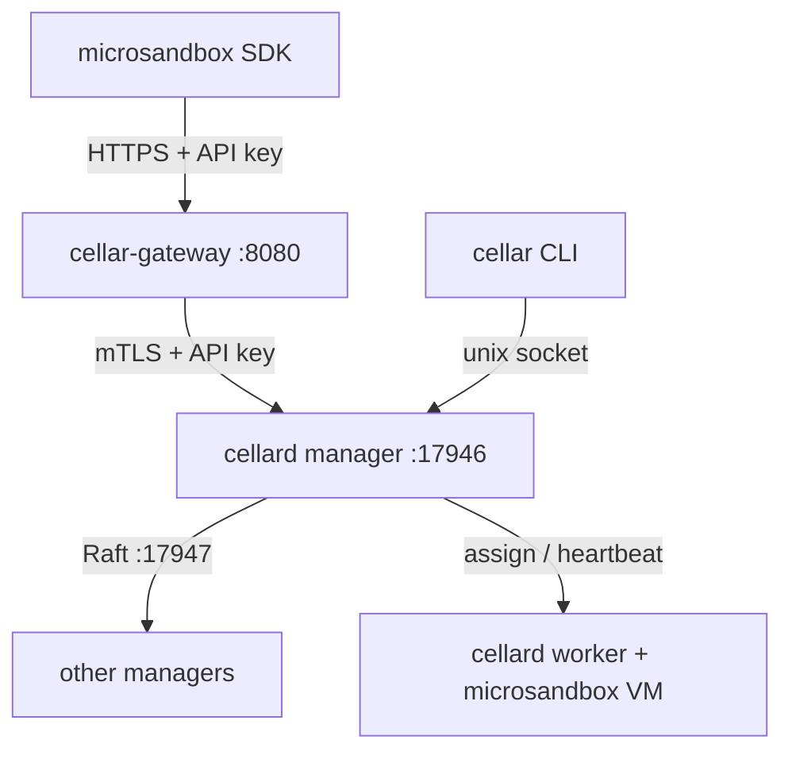

Cellar is a control plane for [microsandbox](https://github.com/superradcompany/microsandbox) VMs. Three binaries run on your machines: a node daemon, a CLI, and an HTTP gateway. Together they keep cluster identity in Raft, schedule sandboxes onto live nodes, and expose the cloud API the official microsandbox SDKs already speak.

## How it fits together

Every host that should run sandboxes — or vote in the control plane — runs **`cellard`**. After `cellar init` or `cellar join`, that daemon is either a **manager** or a **worker**.

Managers replicate cluster state over Raft: the root CA, join tokens, node records, API keys, and desired sandbox state. The Raft **leader** signs certificates, accepts writes, and places new sandboxes on the least-loaded live node. Workers do not vote. They heartbeat to a manager and reconcile the sandboxes assigned to them, using KVM on Linux or Virtualization.framework on macOS.

Operators talk to the daemon on the same machine through the **`cellar`** CLI (unix socket). Applications talk to **`cellar-gateway`** over HTTP. The gateway loads the cluster CA from disk, dials a manager `SandboxAPI`, and forwards the caller's API key. There is no Cellar SDK — point the official microsandbox SDK at the gateway.



## Binaries

### `cellard`

`cellard` is the always-on node process. Install it as a systemd unit or LaunchAgent and leave it running — the CLI and gateway both assume it is up.

On every node it:

- Serves a **local Control API** on a unix socket. `cellar init`, `join`, `status`, `api-key`, `node`, and `sandbox` all go through this socket. Only processes that can open it can administer the node.
- After the node joins a cluster, serves **remote gRPC** on `:17946` (the advertise address you pass to `init` / `join`). Other nodes use this for CA issue/renew, Raft membership, heartbeats, and the public sandbox API.
- Drives sandboxes through the official microsandbox Go SDK. It is built with `CGO_ENABLED=1` and needs `/dev/kvm` on Linux or Virtualization.framework on macOS. On first sandbox use it runs `EnsureInstalled` to fetch the microsandbox CLI and firmware if needed.

On **managers** it also runs Raft, the cluster CA signer (leader only), scheduling, and `SandboxAPI` — the gRPC surface `cellar-gateway` calls.

On **workers** it heartbeats to a manager, pulls assigned sandboxes, and reconciles them with the local driver. It does not hold the CA private key and does not join the Raft quorum.

```bash
cellard --data-dir /var/lib/cellar --socket /var/run/cellar/cellar.sock
# --listen :17946   remote gRPC (after init/join)
# --raft-addr :17947
```

On macOS the defaults are `~/.cellar` for the data directory and `~/.cellar/cellar.sock` for the socket.

### `cellar`

`cellar` is the operator CLI. It never dials the cluster over the network itself: every command talks to the **local** `cellard` over the unix socket (override with `--socket`). `cellard` is what reaches other managers.

| Command group                         | Purpose                                                                                                                                   |
| ------------------------------------- | ----------------------------------------------------------------------------------------------------------------------------------------- |
| `init`, `join`, `leave`, `join-token` | Create a cluster, add this node, leave, or print a join command                                                                           |
| `status`                              | Node id, role, whether this process is the Raft leader                                                                                    |
| `api-key`                             | Mint and revoke keys (`create`, `ls`, `rm`). Writes must run on the leader                                                                |
| `node`                                | Membership, availability (`pause` / `drain`), labels (`ls`, `inspect`, `promote`, `demote`, `update`, `rm`)                               |
| `sandbox`                             | Local admin (`create`, `ls`, `inspect`, `start`, `stop`, `logs`, `rm`). Desired state is written to Raft; the assigned node starts the VM |

Use the CLI to stand up the cluster and to debug. Application workloads should use the [gateway](/docs/api) and the official microsandbox SDKs, not `cellar sandbox …` from app code.

See [non-root access](/docs/install/non-root) to run the CLI without `sudo`.

### `cellar-gateway`

`cellar-gateway` is the HTTP/JSON front door. Run it beside `cellard` on any manager or worker that should accept app traffic. Default listen `:8080`.

It reads the cluster CA from `--data-dir` (the same directory `cellard` uses). Managers dial their own advertise address; workers dial the stored manager address plus any addresses rediscovered from heartbeats. Override with `--upstreams host:17946,…` when you want an explicit multi-manager list.

Inbound requests authenticate with `Authorization: Bearer cellar_…` or `X-Api-Key`. The gateway forwards that key to manager `SandboxAPI` over mTLS. Terminate TLS at a load balancer or reverse proxy — the process itself speaks HTTP.

```bash
cellar-gateway --listen :8080 --data-dir /var/lib/cellar
```

`/healthz` means the process is up. `/readyz` means it can reach a manager `SandboxAPI`. Routes, API keys, and SDK setup live under [Client API](/docs/api).

## Roles

| Role        | Join token    | Raft  | Holds RootCA key                | Control plane |
| ----------- | ------------- | ----- | ------------------------------- | ------------- |
| **Manager** | manager token | Voter | Yes (via Raft `Cluster.RootCA`) | Yes           |
| **Worker**  | worker token  | No    | No                              | No            |

A **manager** is a Raft voter. It stores the replicated `Cluster.RootCA` (private key, cert, and join secrets) and serves control-plane RPCs. One manager is enough to start; an odd number keeps quorum if you add more.

A **worker** joins with a worker token. It receives a leaf certificate but never the CA key, and it does not run Raft. Workers exist to run sandboxes. Managers run sandboxes too — role is about the control plane, not capacity.

You can [promote or demote](/docs/nodes) a node later. Role changes take effect on the next heartbeat: the node re-issues its cert and opens or closes Raft.

The CA private key and join secrets live on the raft-backed `Cluster.RootCA` object. Local disk stores only this node's leaf cert/key and the public CA cert.

## Ports and sockets

| Listener     | Default                       | Auth                                                                           | Purpose                                                                         |
| ------------ | ----------------------------- | ------------------------------------------------------------------------------ | ------------------------------------------------------------------------------- |
| Unix socket  | `/var/run/cellar/cellar.sock` | Local FS permissions                                                           | `Init`, `Join`, `JoinToken`, `Status`, `api-key …`, `node …`, local sandbox ops |
| Remote gRPC  | `:17946`                      | Bootstrap insecure TLS + token digest; else mTLS **or** API key (`SandboxAPI`) | CA issue/renew, raft membership, public sandbox client API                      |
| Gateway HTTP | `:8080`                       | API key (`Authorization: Bearer` / `X-Api-Key`); terminate TLS at ALB/proxy    | Public JSON API for apps (`cellar-gateway`)                                     |
| Raft TCP     | `:17947`                      | Manager network                                                                | Consensus / CA key replication                                                  |

On macOS the unix socket and data directory default to `~/.cellar/cellar.sock` and `~/.cellar`. On Linux the socket is mode `0660` and owned by `cellar:cellar`.

`init` / `join` fill an empty host on `--advertise-addr` and `--raft-addr` with a private IPv4 (or `127.0.0.1` if none is found). Pass a reachable address when other nodes must dial this host.

Keep Raft and gRPC advertise addresses as real node-reachable IPs. Do not point intra-cluster traffic at a public load balancer — that belongs in front of `cellar-gateway` only. See [AWS load balancer](/docs/api/load-balancer).

## Cluster CA

The cluster CA is how nodes trust each other. The private key is replicated in Raft so any manager can become signer after a failover — it is not pinned to the first node's disk.

1. `cellar init` generates a RootCA in memory, issues a local manager leaf, bootstraps Raft, and proposes `CreateCluster` with `CAKey` + `CACert` + join tokens.
2. Every manager receives the same `Cluster.RootCA` through the raft log and snapshots.
3. Only the **leader** runs the CA signer (`UpdateRootCA` from the store). On failover, the new leader loads signing material from raft — it does not re-seed from disk.
4. External APIs never return `CAKey`. `GetRootCACertificate` is cert-only; `Cluster.Redact()` strips the key before anything leaves the control plane.

Join uses a short bootstrap: insecure TLS plus a token digest, just long enough to issue a leaf. After that, node-to-node gRPC is mTLS. The gateway authenticates apps with API keys and uses the cluster CA only for its own connection to `SandboxAPI`.
