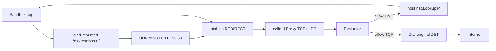

# Egress

Transparent userspace egress for Cellar sandboxes. Guest apps use normal DNS and TCP; **cellard** steers packets with iptables `REDIRECT` and enforces allow/denylist policy in userspace before re-dialing out from the host.

There is no HTTP/SOCKS client config inside the guest. Network mode `none` (or empty) skips this path entirely: Docker `NetworkMode: "none"`, no resolv.conf mount, no REDIRECT rules.

## Architecture



**Per-node lifecycle**

1. On runtime start, the daemon creates one [`Proxy`](proxy.go) and one [`RedirectManager`](redirect.go), binds ephemeral TCP/UDP ports, and injects them into the runtime agent (`internal/daemon/sandbox.go`).
2. While a sandbox is desired-running with allowlist/denylist, the agent calls `Proxy.SetPolicy` and, after the container has an IP, `Redirect.EnsureSandbox` (`internal/runtime/agent.go`).
3. Container create attaches the sandbox to the `cellar-sandboxes` bridge, writes a host-side resolv.conf, and bind-mounts it over the guest’s `/etc/resolv.conf` (`internal/runtime/docker.go`, `internal/runtime/sandboxdir.go`).
4. Teardown / shutdown removes REDIRECT rules and policies, then closes the proxy.

## Container DNS (bind-mounted resolv.conf)

On user-defined bridges, Docker always writes `nameserver 127.0.0.11` into the guest. `HostConfig.DNS` only configures that stub’s upstream (`ExtServers`). Apps still query `127.0.0.11`, which never shows up as host-visible `src=<containerIP> udp/53` for iptables REDIRECT (especially under runsc).

Cellar bypasses the stub by **bind-mounting** its own resolv.conf over the guest file.

### Host file → guest mount

| Side | Path / constant |
|------|-----------------|
| Host source | `{dataDir}/sandboxes/{id}/resolv.conf` (`ResolvConfPath`) |
| Guest target | `/etc/resolv.conf` (`guestResolvConf`) |
| Mount | read-only bind, appended in `Driver.CreateAndStart` for allow/denylist |

`WriteEgressResolvConf` writes:

```text
nameserver 203.0.113.53
options ndots:0
```

- **`203.0.113.53`** (TEST-NET-3 / RFC 5737) is a bait nameserver, not a real resolver. iptables REDIRECTs UDP/53 from the sandbox to cellard’s egress proxy before the packet leaves the host.
- **`ndots:0`** stops search-domain expansion from flooding the egress DNS proxy.
- `host.DNS = []string{egressDNSBait}` is kept for Docker inspect consistency; the **bind mount** is what actually bypasses the embedded stub.
- `CleanupSandboxDir` removes the sandbox host dir (including `resolv.conf`) on teardown or create failure.

### DNS packet path

1. App reads `/etc/resolv.conf` → queries `203.0.113.53:53/udp`.
2. Host nat `PREROUTING` / `OUTPUT` REDIRECT → cellard’s UDP listener.
3. `handleDNS`: parse QNAME → `allowDNSAny` → `net.LookupIP` on the **host** → first IPv4 A (response TTL 60) → remember IP→hostname for 5 minutes → reply.
4. Denied queries are dropped (no NXDOMAIN). Only IPv4 A answers are produced today.

## TCP transparent proxy

1. App connects to a resolved IP (or literal IP):port.
2. iptables REDIRECTs TCP (except destinations in `127.0.0.0/8`) to the proxy’s TCP port.
3. `handleTCP` uses `SO_ORIGINAL_DST` to recover the intended address.
4. `allowAny` checks that destination (IP plus any hostname from the recent DNS cache).
5. On allow: dial the original destination from the host and splice with bidirectional `io.Copy`. On deny: close.

Hostname allowlists therefore require DNS to go through the proxy first so the IP→name cache is populated. Literal IPs / CIDR rules still work without prior DNS.

## iptables REDIRECT

[`RedirectManager`](redirect.go) installs (and later deletes) four nat rules per sandbox container IP:

| Chain | Match | Action |
|-------|--------|--------|
| `OUTPUT` / `PREROUTING` | `-s <ip> -p tcp ! -d 127.0.0.0/8` | `REDIRECT --to-ports <TCPPort>` |
| `OUTPUT` / `PREROUTING` | `-s <ip> -p udp --dport 53` | `REDIRECT --to-ports <UDPPort>` |

Requires root / `CAP_NET_ADMIN`. Loopback TCP is excluded so in-container local sockets are not redirected. DNS is not loopback-excluded (the bait is non-loopback).

## Policy

Policy types live in `internal/sandbox` (`NetworkPolicy`, `NetworkRule`, `DNSPolicy`). Modes: `none`, `allowlist`, `denylist` (network and DNS). Host patterns: exact name, subdomain of a name, leading-dot suffix (`.bad.com`), literal IP, or CIDR. Optional ports; protocols are effectively TCP in v1.

[`Evaluator`](policy.go) applies a single sandbox’s policy. The proxy stores evaluators by sandbox ID, but **`allowAny` / `allowDNSAny` OR across all registered policies on the node**. Who can *send* traffic is primarily constrained by the source-IP iptables match; the userspace check is not a per-connection sandbox identity gate.

CLI / YAML (`--allow-host`, `--allow-port`, or `examples/sandbox-allowlist.yaml`) currently build one TCP rule plus DNS names equal to those hosts. Richer nested `rules` / `dns` exist in the proto and Go types if set via the API.

## Package map

| File | Role |
|------|------|
| [`proxy.go`](proxy.go) | Listeners, TCP/DNS handlers, IP→hostname cache |
| [`dns.go`](dns.go) | Minimal DNS QNAME parse and A-response build |
| [`policy.go`](policy.go) | Userspace allow/deny evaluator |
| [`redirect.go`](redirect.go) | iptables install / remove |

**Runtime wiring (not in this package)**

| Location | Role |
|----------|------|
| `sandboxdir.go` — `WriteEgressResolvConf`, `guestResolvConf` | Host resolv.conf + guest mount target |
| `docker.go` — `CreateAndStart` | Bridge attach + bind-mount resolv.conf |
| `agent.go` — `setupEgress` | `EnsureSandbox` after container IP is known |
| `daemon/sandbox.go` | Owns proxy + redirect lifecycle |

## Operational notes

- Privileges: REDIRECT needs `CAP_NET_ADMIN` / root.
- Proxy listens on ephemeral `0.0.0.0:0` TCP and UDP; ports are stored on `Proxy.TCPPort` / `UDPPort`.
- Resolution uses the host’s resolver (`net.LookupIP`), not a configurable recursive upstream.
- IPv4-centric today (A records, IPv4 original destination).
- Network `none`: no external connectivity and no egress setup.
