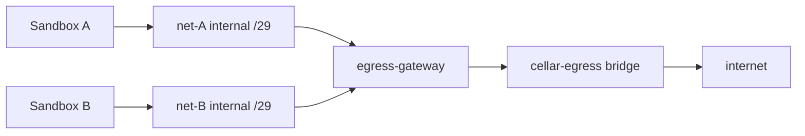

# Egress

Topology-based egress for Cellar sandboxes. Each sandbox sits on a private
**internal** Docker network with no route to the internet. A shared
`cellar/egress-gateway` container is dual-homed onto that network and onto a
normal `cellar-egress` bridge; it is the only possible path out.

There is no host iptables, no host `NET_ADMIN`, and no per-OS code path. Mode
`none` (or empty) skips this path: Docker `NetworkMode: "none"`, no sandbox
network, no gateway registration.

## Architecture



**Principles**

1. **The firewall is the topology.** A sandbox on an `Internal: true` network
   with only the gateway as peer cannot send packets anywhere else.
2. **Deny by default** falls out of that design: unresolved or unhandled
   destinations have nowhere to go.
3. **Accept-then-decide.** The gateway accepts TCP, peeks SNI/Host, then
   applies policy. A blocked destination can show `connect()` success inside
   the sandbox; the connection dies at policy time.
4. **Shared gateway, isolated networks.** One gateway serves many sandboxes;
   each sandbox gets its own two-endpoint network.

## Per-node lifecycle

1. On runtime start, cellard ensures the `cellar-egress` bridge, **removes any
   leftover** managed gateway containers, and spawns a fresh gateway from the
   configured image (`internal/egress/pool`). It also opens an IPAM allocator
   over the configured supernet (`internal/egress/ipam`, default
   `172.30.0.0/16`). Gateways are not adopted across restarts so a rebuilt
   image is always used.
2. Sandbox spawn (ordered):
   1. Allocate a `/29`; `NetworkCreate` an internal net
   2. `NetworkConnect` the chosen gateway at the conventional `.2` address
   3. gRPC `RegisterSandbox` on the gateway’s published control port
   4. `ContainerCreate` the sandbox on that net with `DNS: [.2]` and IP `.3`
3. Per-sandbox teardown reverses those steps idempotently. On daemon stop (or
   leave), sandboxes are torn down first, then the pool force-removes all
   gateway containers. A reconciler GCs labeled orphan networks and rebuilds
   IPAM from Docker state after restart.

## Configuration

`cellard` flags (see `cmd/cellard`) feed `daemon.Config` → `pool.Config` / IPAM:

| Flag / field | Default | Role |
|---|---|---|
| `--egress-gateway-max-legs` (`MaxLegs`) | `100` | Soft cap on concurrent sandbox network legs per gateway container. Each `NetworkConnect` adds one interface. `Assign` picks the least-loaded gateway under the cap and spawns another container when all are full. |
| `--egress-gateway-image` (`Image`) | `cellar/egress-gateway` | Docker image used when spawning gateway containers. |
| `--data-dir` (`DataDir`) | OS default | Per-gateway control tokens under `{dataDir}/egress/<gwID>/control.token` and IPAM state at `{dataDir}/egress/ipam.json`. Token dirs are removed with the gateway. |
| `--egress-allow-private-cidrs` (`PrivateExceptions`) | empty | Comma-separated CIDRs exempted from the gateway’s default deny of RFC1918 / CGNAT / loopback / link-local upstream dials. Node-level policy, not a scaling knob. |
| `--egress-supernet` | `172.30.0.0/16` | IPv4 space carved into per-sandbox `/29`s (IPAM; orthogonal to MaxLegs). |

Pool internals (not flags): containers are labeled `cellar.managed=true` and
`cellar.role=egress-gateway`; they attach to the shared `cellar-egress` bridge;
control is gRPC on published loopback → container `:17948` with a bearer token.

## IPAM

Cellard owns allocation (Docker’s default pools are too coarse):

| Offset | Role |
|--------|------|
| `.1` | Docker bridge gateway (auto) |
| `.2` | cellar egress-gateway leg |
| `.3` | sandbox |

State is persisted under `{dataDir}/egress/ipam.json`. Configure the supernet
with `cellard --egress-supernet`.

## DNS

The gateway runs DNS on UDP+TCP `:53` bound to each sandbox leg’s `.2` IP.

- Allowed A queries → answer with **the gateway’s own `.2` IP** (TTL 10s)
- Denied → **NXDOMAIN**
- Never return real upstream IPs to sandboxes

Sandboxes bind-mount a generated `resolv.conf` (`nameserver <gateway .2>`)
over `/etc/resolv.conf`. `HostConfig.DNS` alone is not enough: on user-defined
networks Docker still writes `127.0.0.11`, and that stub's forwarding behavior
varies by Engine version (and can escape topology on older engines). Attribution
uses which gateway leg received the query. Hardcoded IP escape attempts fail
structurally (no route off the internal net).

## Data plane

| Port | Behavior |
|------|----------|
| TCP 443 | Peek SNI; deny if missing; resolve+dial real upstream; splice |
| TCP 80 | Peek Host; splice (header-transform hook is a no-op for now) |
| Other TCP | In-gateway iptables REDIRECT → catch-all; `SO_ORIGINAL_DST` for port; allow only hosts with explicit port rules |
| UDP 53 | DNS as above |
| Other UDP | Unhandled (QUIC/HTTP3 fail; TCP fallback expected) |

Upstream dials still refuse `DeniedCIDRs` (RFC1918, CGNAT, loopback, link-local)
unless carved out with `cellard --egress-allow-private-cidrs`.

## Control plane

gRPC over a published loopback TCP port (`127.0.0.1:<ephemeral>` → container
`:17948`). The pool mints a bearer token, stores it under
`{dataDir}/egress/<gwID>/control.token`, and passes it to the gateway via
`CELLAR_EGRESS_CONTROL_TOKEN`. Proto: [`api/proto/egress_gateway.proto`](../../api/proto/egress_gateway.proto).

- `RegisterSandbox` / `DeregisterSandbox`
- `UpdatePolicy` — full replace (parity with `UpdateNetwork`)

Public sandbox `NetworkPolicy` modes: `none` (no topology), `allowlist`,
`denylist`, `blockall` (deny-all with topology), and `allowall` (allow-all
with topology; both can toggle live). Network limits (`network_allow_list`,
`domain_allow_list`, `block_all`, `allow_all`) are translated to canonical
mode/rules on create/update. Optional `essential_services` adds a curated
package/git/AI domain allowlist evaluated in the gateway. Alone (no other
limit), it implies `block_all`.

## Image

Networked sandboxes need the `cellar/egress-gateway` Docker image. Releases ship
per-arch `docker save` archives that the curl installer loads with `docker load`.
Build locally from a source checkout with:

```bash
curl -fsSL https://cellar.prodioslabs.com/install.sh | sh
# or from a source checkout: make egress-gateway-image
# or: make egress-gateway-image-tarball   # gzipped docker save archive
```

Because gateways are recreated on every runtime start, rebuilding the image and
restarting `cellard` is enough to pick up the new binary.

## Known tradeoffs

- `connect()` may succeed before policy denies (accept-then-decide)
- No egress for UDP-only protocols or connections without readable SNI/Host
- ECH-enabled clients are denied on `:443`
- HTTPS credential injection requires opt-in MITM (out of scope)

## Key files

| Path | Role |
|------|------|
| `cmd/cellar-egress-gateway` | Gateway process entrypoint |
| `internal/egress/gateway` | Data plane + gRPC control server |
| `internal/egress/pool` | Gateway container pool |
| `internal/egress/ipam` | `/29` allocator |
| `internal/egress/policy.go` | Shared allow/deny evaluator |
| `internal/runtime/docker.go` | Per-sandbox Internal nets |
| `internal/runtime/agent.go` | Spawn/teardown/reconcile |
| `images/egress-gateway/Dockerfile` | Gateway image |
