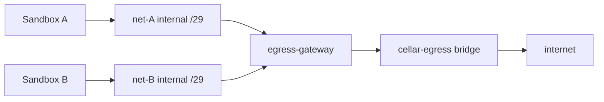

# Egress

This package is how Cellar sandboxes reach the internet — and how they are
kept from reaching anything they shouldn't.

If you are new to Cellar: a sandbox is an isolated container. By default it
should not be able to talk to the host, to other sandboxes, or to arbitrary
destinations on the public internet. When a sandbox *does* need network
access, Cellar does not poke holes in the host firewall. Instead it builds a
small private topology where the only way out is through a shared
**egress gateway** that enforces policy.

Mode `none` (or an empty network mode) skips all of this: Docker
`NetworkMode: "none"`, no sandbox network, no gateway registration.

There is no host iptables, no host `NET_ADMIN`, and no per-OS networking code
path. The same design runs on Linux and on macOS / Docker Desktop.

---

## The idea in one picture

Each sandbox sits alone on a tiny private Docker network marked `Internal:
true`. That flag means Docker will not give the network a route to the host
or the internet. The only other peer on that network is a leg of the shared
`cellar/egress-gateway` container. That gateway is also attached to a normal
bridge (`cellar-egress`) that *can* reach the outside world.



So sandboxes never share a network with each other, and they never see a
default route that bypasses the gateway. Isolation is mostly topology;
policy is a second check once traffic arrives at the gateway.

---

## Design principles

1. **The firewall is the topology.** A sandbox on an internal network with
   only the gateway as peer physically cannot send packets anywhere else.
   Policy is defense in depth, not the first line of isolation.
2. **Deny by default.** Unmatched destinations either never leave the
   internal net, or they hit the gateway and are denied.
3. **Accept, then decide.** The gateway accepts the TCP connection first,
   peeks enough of the traffic to know the destination (SNI, HTTP Host, or
   the original IP:port), then applies policy. That means a blocked
   destination can briefly look like a successful `connect()` inside the
   sandbox — the connection dies a moment later when policy rejects it.
4. **Shared gateway, isolated networks.** One gateway container can serve
   many sandboxes. Each sandbox still gets its own two-endpoint network so
   sandboxes cannot talk to each other sideways.

---

## Lifecycle (order matters)

Egress is built in layers. Getting the order wrong leaves a sandbox that
looks networked but cannot resolve names, or that can dial IPs but skip
policy. The code follows the sequences below on purpose.

### 1. When `cellard` starts the runtime

Before any sandbox is created, the node prepares shared egress plumbing:

1. Open the IPAM allocator over the configured supernet (default
   `172.30.0.0/16`), loading prior assignments from
   `{dataDir}/egress/ipam.json` when present.
2. Ensure the shared `cellar-egress` Docker bridge exists.
3. **Remove any leftover** managed gateway containers from a previous run
   (gateways are never adopted across restarts, so a rebuilt image is
   always used).
4. Spawn a fresh `cellar/egress-gateway` container from the configured
   image, mint a control bearer token, and publish its gRPC control port
   on loopback.

Sandboxes that need network will attach to this pool later. If the pool
fails to come up, networked sandbox creates on this node will fail.

### 2. When a networked sandbox is created

This is the critical path. Steps run in this order; each step cleans up
earlier ones on failure:

| Step | What happens | Why this order |
|------|--------------|----------------|
| 1 | **IPAM** allocates a `/29` for the sandbox | Need a subnet before creating the Docker network |
| 2 | **Create** an `Internal: true` Docker network for that `/29` | Topology must exist before anything attaches |
| 3 | **Assign** a gateway instance from the pool (least-loaded under `MaxLegs`) | Pick which shared gateway will own this leg |
| 4 | **Connect** that gateway onto the sandbox net at the conventional `.2` address | Gateway must be reachable as next hop / DNS before the guest starts |
| 5 | **gRPC `RegisterSandbox`** on the gateway control port (policy + IPs) | Gateway must know the sandbox *before* traffic can arrive |
| 6 | Persist `egress.json` under the sandbox host dir | So teardown / reconcile can find the assignment after a crash |
| 7 | **`ContainerCreate` / start** the sandbox on that net at `.3`, with a bind-mounted `resolv.conf` pointing at `.2` | Guest only joins once the gateway leg and DNS are ready |
| 8 | **Route helper** (one-shot container, `NetworkMode: container:<sandbox>`, `CAP_NET_ADMIN`, same egress-gateway image) runs `ip route replace default via .2` | Off-subnet traffic — including raw-IP / CIDR allowlist flows — must hit the gateway, not Docker’s on-link `.1` |

The sandbox itself keeps `CapDrop: ALL`. Only the short-lived route helper
gets `NET_ADMIN`, and only inside the sandbox’s network namespace.

Mode `none` / empty skips every step above and uses Docker
`NetworkMode: "none"`.

### 3. While the sandbox is running

- DNS and TCP from the sandbox arrive at the gateway (see [Data plane](#data-plane) below).
- Live policy changes go through gRPC `UpdatePolicy` (full replace, not
  merge) — same shape as the public `UpdateNetwork` API.
- Optional `essential_services` adds a curated package/git/AI domain
  allowlist evaluated inside the gateway. Alone (with no other network
  limit), it implies `block_all`.

### 4. When the sandbox is torn down

Teardown reverses setup, and is idempotent:

1. `DeregisterSandbox` on the gateway (drop DNS listeners / session state)
2. Disconnect the gateway leg from the sandbox network
3. Release the sandbox’s slot in the gateway pool
4. Remove the sandbox’s Docker network
5. Free the `/29` back to IPAM

### 5. When the daemon stops (or leaves the cluster)

Sandboxes are torn down first, then the pool force-removes all gateway
containers. A reconciler also GCs labeled orphan networks and rebuilds
IPAM from live Docker state after a restart, so a crash mid-spawn does
not permanently leak subnets.

---

## Addressing (what `.1`, `.2`, and `.3` mean)

Cellard owns allocation because Docker’s default address pools are too
coarse for one tiny network per sandbox. Each sandbox gets a `/29` carved
from `--egress-supernet`:

| Offset | Role |
|--------|------|
| `.1` | Docker bridge gateway (auto). On-link only — an `Internal` net has no host NAT |
| `.2` | Egress-gateway leg. Sandbox DNS nameserver **and** default-route next hop |
| `.3` | The sandbox itself |

State lives at `{dataDir}/egress/ipam.json`.

---

## How a request actually leaves the sandbox

Two paths matter. Both end at the same gateway; they differ in how the
destination is discovered.

### Path A — domain traffic (the usual case)

1. The guest asks DNS for `example.com`.
2. The query goes to `.2` (forced via the bind-mounted `resolv.conf`).
3. The gateway evaluates DNS policy:
   - **Allowed** → answer with **the gateway’s own `.2` IP** (TTL 10s). Never
     a real upstream A record.
   - **Denied** → **NXDOMAIN**.
4. The guest connects to that bait IP on port 80 or 443 (or another
     allowed port).
5. The gateway accepts, peeks TLS SNI or HTTP Host, applies connect policy,
   then dials the *real* upstream by hostname and splices the streams.

Returning the gateway’s own IP is intentional: the sandbox thinks it is
talking to `example.com`, but every byte still flows through policy.

CIDR-only allowlists intentionally NXDOMAIN all names. Those workloads
must use raw IPs that match the CIDR rules (Path B).

### Path B — raw IP / CIDR traffic

1. The guest dials an external IP directly.
2. Because of the route helper, the default route is via `.2`, so the
   packet still arrives at the gateway with the original destination
   preserved.
3. iptables REDIRECT sends it to the gateway’s catch-all listener.
4. The gateway recovers `SO_ORIGINAL_DST` (ip:port), evaluates CIDR/IP
   policy, dials that address, and splices.

Without step 8 of sandbox create (the route helper), this path would die
at Docker’s `.1` and CIDR rules would silently never work.

### What the gateway handles

| Traffic | Behavior |
|---------|----------|
| TCP 443 → `.2` (DNS bait) | Peek SNI; deny if missing; resolve + dial real upstream; splice |
| TCP 80 → `.2` (DNS bait) | Peek Host; splice (header-transform hook is a no-op for now) |
| Other TCP → `.2` (DNS bait) | REDIRECT → catch-all; recover port via `SO_ORIGINAL_DST`; allow only when an explicit domain:port rule matches recent DNS |
| TCP to external IP (routed) | Default route via `.2` → REDIRECT → catch-all; recover ip:port; evaluate CIDR/IP policy; dial original |
| UDP 53 | DNS as above |
| Other UDP | Unhandled (QUIC / HTTP3 fail; clients are expected to fall back to TCP) |

Upstream dials also refuse always-denied ranges (RFC1918, CGNAT, loopback,
link-local — including cloud metadata at `169.254.169.254`) unless the
node operator carved them out with `--egress-allow-private-cidrs`. A
sandbox spec can never widen that list.

---

## DNS details

The gateway runs DNS on UDP+TCP `:53` bound to each sandbox leg’s `.2` IP.
Attribution uses **which gateway leg received the query**, so one shared
gateway can answer differently per sandbox.

Sandboxes bind-mount a generated `resolv.conf` (`nameserver <gateway .2>`,
`ndots:0`) over `/etc/resolv.conf`. Setting `HostConfig.DNS` alone is not
enough: on user-defined networks Docker still writes `127.0.0.11`, and that
stub’s forwarding behavior varies by Engine version (and can escape
topology on older engines). The bind mount is the engine-version-
independent way to force every lookup through the gateway.

---

## Control plane

gRPC over a published loopback TCP port (`127.0.0.1:<ephemeral>` →
container `:17948`). The pool mints a bearer token, stores it under
`{dataDir}/egress/<gwID>/control.token`, and passes it into the gateway as
`CELLAR_EGRESS_CONTROL_TOKEN`.

Proto: [`api/proto/egress_gateway.proto`](../../api/proto/egress_gateway.proto).

| RPC | Purpose |
|-----|---------|
| `RegisterSandbox` | Attach a sandbox session (IPs, subnet, initial policy) |
| `DeregisterSandbox` | Tear down that session |
| `UpdatePolicy` | Full replace of the sandbox’s network policy |

### Policy modes (public sandbox API)

| Mode | Meaning |
|------|---------|
| `none` | No topology; Docker `NetworkMode: "none"` |
| `allowlist` | Only listed domains / CIDRs |
| `denylist` | Everything except listed domains / CIDRs |
| `blockall` | Topology present, deny all (unless `essential_services`) |
| `allowall` | Topology present, allow all (still subject to always-denied CIDRs) |

Convenience fields on create/update (`network_allow_list`,
`domain_allow_list`, `block_all`, `allow_all`) are translated into the
canonical mode/rules shape before they reach the gateway.

---

## Configuration

`cellard` flags (see `cmd/cellard`) feed `daemon.Config` → `egress.PoolConfig` / IPAM:

| Flag / field | Default | Role |
|---|---|---|
| `--egress-gateway-max-legs` (`MaxLegs`) | `100` | Soft cap on concurrent sandbox network legs per gateway container. Each `NetworkConnect` adds one interface. `Assign` picks the least-loaded gateway under the cap and spawns another when all are full. |
| `--egress-gateway-image` (`Image`) | `cellar/egress-gateway` | Image for gateway containers and the per-sandbox route helper. |
| `--data-dir` (`DataDir`) | OS default | Per-gateway control tokens under `{dataDir}/egress/<gwID>/control.token` and IPAM state at `{dataDir}/egress/ipam.json`. Token dirs are removed with the gateway. |
| `--egress-allow-private-cidrs` (`PrivateExceptions`) | empty | Comma-separated CIDRs exempted from the always-deny private ranges. Node-level policy, not a scaling knob. |
| `--egress-supernet` | `172.30.0.0/16` | IPv4 space carved into per-sandbox `/29`s (orthogonal to MaxLegs). |

Pool internals (not flags): containers are labeled `cellar.managed=true` and
`cellar.role=egress-gateway`; they attach to the shared `cellar-egress`
bridge; control is gRPC on published loopback → container `:17948` with a
bearer token.

### Minimal example

```yaml
# examples/sandbox-allowlist.yaml
id: demo-curl
image: curlimages/curl
network:
  domain_allow_list: example.com
```

```bash
cellar sandbox create -f examples/sandbox-allowlist.yaml
```

---

## Image

Networked sandboxes need the `cellar/egress-gateway` Docker image (gateway
binary, `iptables`, and `iproute2` for the route helper). Releases ship
per-arch `docker save` archives that the curl installer loads with
`docker load`. From a source checkout:

```bash
make egress-gateway-image
# or: make egress-gateway-image-tarball   # gzipped docker save archive
```

Because gateways are recreated on every runtime start, rebuilding the
image and restarting `cellard` is enough to pick up a new binary.

---

## Known tradeoffs

- `connect()` may succeed before policy denies (accept-then-decide).
- No egress for UDP-only protocols (including UDP to CIDR destinations);
  policy protocols are v1 `tcp` only.
- The domain path on `:443` still needs readable SNI; ECH-enabled clients
  are denied.
- The route helper adds a small per-spawn latency (hundreds of ms).
- HTTPS credential injection would require opt-in MITM (out of scope).

---

## Key files

A quick map of what lives where. Start with `server.go` and `pool.go` if you
are new; the rest are supporting pieces.

### In this package (`internal/egress`)

| File | What it is |
|------|------------|
| `server.go` | The egress-gateway process itself: start/stop, bearer-auth gRPC control (`RegisterSandbox` / `DeregisterSandbox` / `UpdatePolicy`), per-sandbox sessions, TCP accept paths (80 / 443 / catch-all), DNS serve, iptables REDIRECT setup, and upstream dial + splice. |
| `pool.go` | What `cellard` runs on the host: ensure the `cellar-egress` bridge, spawn/remove gateway containers, assign sandboxes to the least-loaded gateway, `NetworkConnect` / disconnect legs, and call the control RPCs. |
| `ipam.go` | Host-side `/29` allocator over the egress supernet. Persists assignments to `{dataDir}/egress/ipam.json` and exposes the conventional `.2` / `.3` helpers. |
| `policy.go` | Pure allow/deny evaluator for connect + DNS. Shared by the gateway so verdicts do not depend on Docker or listeners. |
| `dns.go` | Low-level DNS packet helpers: parse question names, build bait A answers (gateway `.2`), build NXDOMAIN. |
| `peek.go` | Read-ahead helpers to extract TLS SNI and HTTP `Host` without consuming bytes the upstream splice still needs. |
| `denied.go` | Always-denied private / loopback / link-local CIDRs, plus parsing for node-level private exceptions. |
| `proxy.go` | Older per-source-IP `Proxy` type and shared helpers (`listenerKind`, `liveConn`, `originalDST`, `proxyCopy`) still used by `server.go`. The `Proxy` path itself is only exercised by unit tests today. |

### Nearby (owned by other packages, but part of the story)

| File | What it is |
|------|------------|
| `cmd/cellar-egress-gateway` | Tiny main: parse flags, require a control token, `NewServer` + `Start`. |
| `internal/runtime/agent.go` | Orchestrates spawn / teardown / reconcile order (IPAM → network → pool → register → container → route helper). |
| `internal/runtime/docker.go` | Creates internal sandbox nets, bind-mounts `resolv.conf`, and runs the one-shot route helper. |
| `api/proto/egress_gateway.proto` | Control API schema. |
| `images/egress-gateway/Dockerfile` | Image that ships the gateway binary plus `iptables` / `iproute2` for the route helper. |
