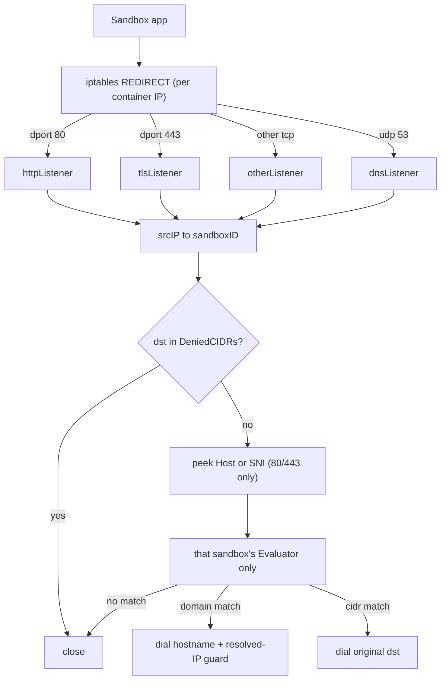

# Egress

Transparent userspace egress for Cellar sandboxes. Guest apps use normal DNS and TCP; **cellard** steers packets with iptables `REDIRECT` and enforces allow/denylist policy in userspace before re-dialing out from the host.

There is no HTTP/SOCKS client config inside the guest. Network mode `none` (or empty) skips this path entirely: Docker `NetworkMode: "none"`, no resolv.conf mount, no REDIRECT rules.

## Architecture



**Per-node lifecycle**

1. On runtime start, the daemon creates one [`Proxy`](proxy.go) and one [`RedirectManager`](redirect.go), binds four ephemeral ports (HTTP, TLS, other TCP, DNS UDP), and injects them into the runtime agent (`internal/daemon/sandbox.go`).
2. While a sandbox is desired-running with allowlist/denylist, the agent calls `Proxy.SetPolicy` and, after the container has an IP, `Proxy.BindSandboxIP` + `Redirect.EnsureSandbox` (`internal/runtime/agent.go`).
3. Container create attaches the sandbox to the `cellar-sandboxes` bridge, writes a host-side resolv.conf, and bind-mounts it over the guest’s `/etc/resolv.conf` (`internal/runtime/docker.go`, `internal/runtime/sandboxdir.go`).
4. Teardown / shutdown removes REDIRECT rules, unbinds the IP, drops the policy (closing live connections), then closes the proxy.

## Container DNS (bind-mounted resolv.conf)

On user-defined bridges, Docker always writes `nameserver 127.0.0.11` into the guest. `HostConfig.DNS` only configures that stub’s upstream (`ExtServers`). Apps still query `127.0.0.11`, which never shows up as host-visible `src=<containerIP> udp/53` for iptables REDIRECT (especially under runsc).

Cellar bypasses the stub by **bind-mounting** its own resolv.conf over the guest file.

### Host file → guest mount

| Side | Path / constant |
|------|-----------------|
| Host source | `{dataDir}/sandboxes/{id}/resolv.conf` (`ResolvConfPath`) |
| Guest target | `/etc/resolv.conf` (`guestResolvConf`) |
| Mount | read-only bind, appended in `Driver.CreateAndStart` for allow/denylist |

`WriteEgressResolvConf` writes:

```text
nameserver 203.0.113.53
options ndots:0
```

- **`203.0.113.53`** (TEST-NET-3 / RFC 5737) is a bait nameserver, not a real resolver. iptables REDIRECTs UDP/53 from the sandbox to cellard’s egress proxy before the packet leaves the host.
- **`ndots:0`** stops search-domain expansion from flooding the egress DNS proxy.
- `host.DNS = []string{egressDNSBait}` is kept for Docker inspect consistency; the **bind mount** is what actually bypasses the embedded stub.
- `CleanupSandboxDir` removes the sandbox host dir (including `resolv.conf`) on teardown or create failure.

### DNS packet path

1. App reads `/etc/resolv.conf` → queries `203.0.113.53:53/udp`.
2. Host nat `PREROUTING` / `OUTPUT` REDIRECT → cellard’s UDP listener.
3. `handleDNS`: parse QNAME → resolve the client IP to its sandbox → that sandbox's `AllowDNS` → `net.LookupIP` on the **host** → first IPv4 A (response TTL 60) → reply.
4. Denied queries are dropped (no NXDOMAIN). Only IPv4 A answers are produced today.

DNS answers do **not** feed the TCP allow path. A guest that resolves a name through some other channel gains nothing: the TCP side derives hostnames from the connection itself (below).

## TCP transparent proxy

1. App connects to an IP:port. iptables REDIRECTs it to one of three listeners depending on the destination port.
2. `handleTCP` maps `conn.RemoteAddr()` to exactly one sandbox via the container-IP registry. An unbound source IP is closed — there is no node-wide union of policies.
3. `SO_ORIGINAL_DST` recovers the intended address. Destinations inside [`DeniedCIDRs`](denied.go) are closed before policy runs.
4. On the HTTP and TLS listeners, [`peek.go`](peek.go) reads the `Host` header or TLS SNI without consuming it (5s deadline; on failure the connection falls through to IP-only evaluation). The other-TCP listener never peeks, so server-first protocols such as SSH and Postgres are not stalled.
5. `Evaluator.AllowConnect(hostname, ip, port)` returns a decision and a match type.
6. On allow, dial and splice with bidirectional `io.Copy`:
   - **domain match** → dial the *hostname*, with a `net.Dialer.ControlContext` guard that rejects any resolved address in `DeniedCIDRs`. The guard runs after resolution and before `connect(2)`, so a guest `/etc/hosts` edit or resolver cannot point an allowed name at an internal address, and Happy Eyeballs still checks every candidate.
   - **cidr match** → dial the original `SO_ORIGINAL_DST` address.

Because a hostname is only observable on ports 80 and 443, **host rules on any other port never match** — use an IP or CIDR there. The CLI warns when a host rule is paired with such a port.

## Hard-denied destinations

[`denied.go`](denied.go) blocks loopback, RFC 1918, CGNAT (`100.64.0.0/10`), and link-local (`169.254.0.0/16`, which covers cloud metadata) plus their IPv6 equivalents, regardless of policy. Operators who need a private destination pass `cellard --egress-allow-private-cidrs 10.20.0.0/16,...`; this is node-level so a sandbox spec cannot widen it.

Consequence: sandbox-to-sandbox traffic over the `cellar-sandboxes` bridge (172.x) is denied by default.

## iptables REDIRECT

[`RedirectManager`](redirect.go) installs (and later deletes) four nat rules per sandbox container IP on both `OUTPUT` and `PREROUTING`, appended in this order so the port-specific rules win:

| Match | Action |
|--------|--------|
| `-s <ip> -p tcp --dport 80 ! -d 127.0.0.0/8` | `REDIRECT --to-ports <HTTPPort>` |
| `-s <ip> -p tcp --dport 443 ! -d 127.0.0.0/8` | `REDIRECT --to-ports <TLSPort>` |
| `-s <ip> -p tcp ! -d 127.0.0.0/8` | `REDIRECT --to-ports <OtherPort>` |
| `-s <ip> -p udp --dport 53` | `REDIRECT --to-ports <UDPPort>` |

Requires root / `CAP_NET_ADMIN`. Loopback TCP is excluded so in-container local sockets are not redirected. DNS is not loopback-excluded (the bait is non-loopback).

## Policy

Policy types live in `internal/sandbox` (`NetworkPolicy`, `NetworkRule`, `DNSPolicy`). Modes: `none`, `allowlist`, `denylist` (network and DNS).

Host patterns are matched against a name or an address, never both:

| Pattern | Matches |
|---------|---------|
| `example.com` | `example.com` and any subdomain |
| `.example.com` | same |
| `*.example.com` | same |
| `*` | any hostname |
| `93.184.216.34` | that address only |
| `10.0.0.0/8` | any address in the range |

A rule's optional `ports` and `protocols` gate both forms; protocols are effectively TCP in v1.

[`Evaluator`](policy.go) applies exactly one sandbox's policy — the one owning the source IP. An allowlist allows on either a hostname or an address match; a denylist denies on either. Allowlist domain matches are re-dialed by name (see above); everything else keeps the original destination.

CLI / YAML (`--allow-host`, `--allow-port`, or `examples/sandbox-allowlist.yaml`) build one TCP rule plus DNS names equal to those hosts. Richer nested `rules` / `dns` exist in the proto and Go types if set via the API.

## Live policy updates

`cellar sandbox network <id> --mode allowlist --allow-host h --allow-port p` replaces the policy of a running sandbox. The leader validates it, writes it to Raft, and then pushes it to the owning node's `SandboxRuntime.ApplyNetworkPolicy`; a failed push is only a latency loss, since the agent's reconcile loop re-applies desired state every tick.

`SetPolicy` re-evaluates every established connection for that sandbox and closes the ones the new policy no longer allows, so locking a sandbox down before running untrusted code does not leave sockets open under the old rules.

Switching to or from mode `none` is rejected with `FailedPrecondition`: `none` is decided at container create (no bridge, no resolv.conf mount, no REDIRECT rules), so it cannot be toggled on a live container.

## Package map

| File | Role |
|------|------|
| [`proxy.go`](proxy.go) | Listeners, sandbox-identity registry, TCP/DNS handlers, live-connection tracking |
| [`peek.go`](peek.go) | TLS SNI and HTTP Host inspection without consuming bytes |
| [`denied.go`](denied.go) | Always-denied internal ranges |
| [`dns.go`](dns.go) | Minimal DNS QNAME parse and A-response build |
| [`policy.go`](policy.go) | Userspace allow/deny evaluator |
| [`redirect.go`](redirect.go) | iptables install / remove |

**Runtime wiring (not in this package)**

| Location | Role |
|----------|------|
| `sandboxdir.go` — `WriteEgressResolvConf`, `guestResolvConf` | Host resolv.conf + guest mount target |
| `docker.go` — `CreateAndStart` | Bridge attach + bind-mount resolv.conf |
| `agent.go` — `setupEgress`, `ApplyNetworkPolicy` | Bind container IP, install REDIRECT, apply live updates |
| `grpcapi/sandbox.go` — `UpdateNetwork` | Leader-side validation and Raft write |
| `daemon/sandbox.go` | Owns proxy + redirect lifecycle, pushes policy to the owning node |

## Operational notes

- Privileges: REDIRECT needs `CAP_NET_ADMIN` / root.
- The proxy listens on ephemeral `0.0.0.0:0` ports, stored on `Proxy.HTTPPort` / `TLSPort` / `OtherPort` / `UDPPort`.
- Resolution uses the host’s resolver (`net.LookupIP`), not a configurable recursive upstream.
- IPv4-centric today (A records, IPv4 original destination).
- Network `none`: no external connectivity and no egress setup.
- Out of scope: non-DNS UDP and ICMP are unfiltered — the REDIRECT rules only cover TCP and UDP/53.
