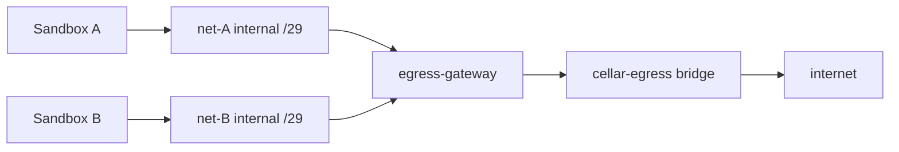

# Egress

Topology-based egress for Cellar sandboxes. Each sandbox sits on a private
**internal** Docker network with no route to the internet. A shared
`cellar/egress-gateway` container is dual-homed onto that network and onto a
normal `cellar-egress` bridge; it is the only possible path out.

There is no host iptables, no host `NET_ADMIN`, and no per-OS code path. Mode
`none` (or empty) skips this path: Docker `NetworkMode: "none"`, no sandbox
network, no gateway registration.

## Architecture

**Principles**

1. **The firewall is the topology.** A sandbox on an `Internal: true` network
   with only the gateway as peer cannot send packets anywhere else.
2. **Deny by default** falls out of that design: unresolved or unhandled
   destinations have nowhere to go.
3. **Accept-then-decide.** The gateway accepts TCP, peeks SNI/Host, then
   applies policy. A blocked destination can show `connect()` success inside
   the sandbox; the connection dies at policy time.
4. **Shared gateway, isolated networks.** One gateway serves many sandboxes;
   each sandbox gets its own two-endpoint network.

## Per-node lifecycle

1. On runtime start, cellard ensures the `cellar-egress` bridge and at least
   one gateway container (`internal/egress/pool`), and opens an IPAM allocator
   over `172.30.0.0/16` (`internal/egress/ipam`).
2. Sandbox spawn (ordered):
   1. Allocate a `/29`; `NetworkCreate` an internal net
   2. `NetworkConnect` the chosen gateway at the conventional `.2` address
   3. gRPC `RegisterSandbox` on the gateway’s Unix control socket
   4. `ContainerCreate` the sandbox on that net with `DNS: [.2]` and IP `.3`
3. Teardown reverses those steps idempotently. A reconciler GCs labeled
   orphan networks and rebuilds IPAM from Docker state after restart.

## IPAM

Cellard owns allocation (Docker’s default pools are too coarse):

| Offset | Role |
|--------|------|
| `.1` | Docker bridge gateway (auto) |
| `.2` | cellar egress-gateway leg |
| `.3` | sandbox |

State is persisted under `{dataDir}/egress/ipam.json`. Configure the supernet
with `cellard --egress-supernet`.

## DNS

The gateway runs DNS on UDP+TCP `:53` bound to each sandbox leg’s `.2` IP.

- Allowed A queries → answer with **the gateway’s own `.2` IP** (TTL 10s)
- Denied → **NXDOMAIN**
- Never return real upstream IPs to sandboxes

Docker’s embedded resolver (`127.0.0.11`) may sit in front and forward to the
configured DNS. Attribution uses which gateway leg received the query.
Hardcoded IP escape attempts fail structurally (no route off the internal net).

## Data plane

| Port | Behavior |
|------|----------|
| TCP 443 | Peek SNI; deny if missing; resolve+dial real upstream; splice |
| TCP 80 | Peek Host; splice (header-transform hook is a no-op for now) |
| Other TCP | In-gateway iptables REDIRECT → catch-all; `SO_ORIGINAL_DST` for port; allow only hosts with explicit port rules |
| UDP 53 | DNS as above |
| Other UDP | Unhandled (QUIC/HTTP3 fail; TCP fallback expected) |

Upstream dials still refuse `DeniedCIDRs` (RFC1918, CGNAT, loopback, link-local)
unless carved out with `cellard --egress-allow-private-cidrs`.

## Control plane

gRPC over Unix socket (`{dataDir}/egress/<gwID>/control.sock`), bind-mounted
into the gateway. Proto: [`api/proto/egress_gateway.proto`](../../api/proto/egress_gateway.proto).

- `RegisterSandbox` / `DeregisterSandbox`
- `UpdatePolicy` — full replace (parity with `UpdateNetwork`)

Public sandbox `NetworkPolicy` (allowlist/denylist) is unchanged; cellard
translates it when talking to the gateway.

## Scaling

Each `NetworkConnect` adds an interface in the gateway. Soft cap ≈ 100 legs
(`--egress-gateway-max-legs`). The pool assigns least-loaded and spawns a new
gateway when all are full.

## Known tradeoffs

- `connect()` may succeed before policy denies (accept-then-decide)
- No egress for UDP-only protocols or connections without readable SNI/Host
- ECH-enabled clients are denied on `:443`
- HTTPS credential injection requires opt-in MITM (out of scope)

## Key files

| Path | Role |
|------|------|
| `cmd/cellar-egress-gateway` | Gateway process entrypoint |
| `internal/egress/gateway` | Data plane + gRPC control server |
| `internal/egress/pool` | Gateway container pool |
| `internal/egress/ipam` | `/29` allocator |
| `internal/egress/policy.go` | Shared allow/deny evaluator |
| `internal/runtime/docker.go` | Per-sandbox Internal nets |
| `internal/runtime/agent.go` | Spawn/teardown/reconcile |
| `images/egress-gateway/Dockerfile` | Gateway image |
